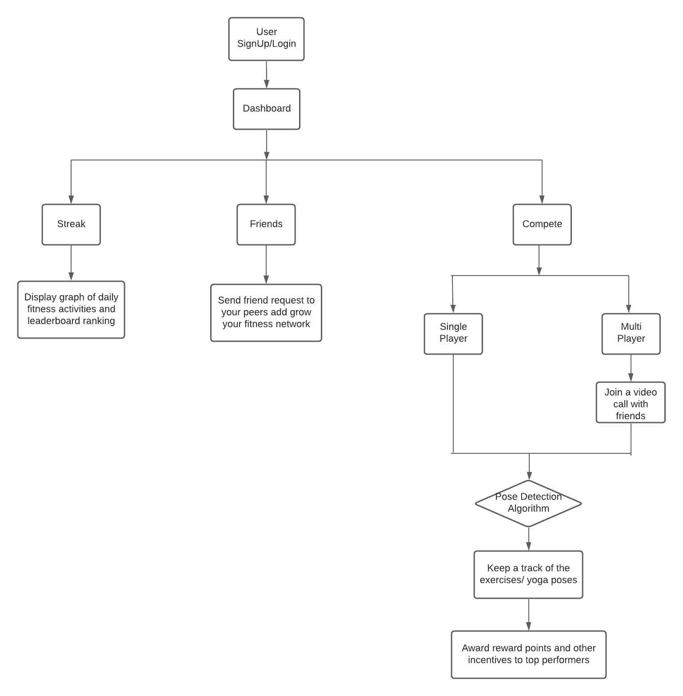

# Streak-Fit
 * Try it out : https://streak-fit.herokuapp.com/
 * Video Demo : https://youtu.be/Dph8nHgxlCo
 
## Problem Statement
- Due to the COVID-19 pandemic gyms, parks, and fitness facilities worldwide have been shut down. It has become difficult for health-conscious people to interact and exercise with their peers. Moreover, students are limited to playing online games. 
- The physical fitness and health among the work-from-home folks during the pandemic has degraded. People have lost of the motivation to exercise in virtual mode.
- Also, online exercise sessions are not productive. It is not possible for the instructor to determine whether the students are exercising correctly through a video call.

## Our Solution
- We present a virtual gym community where people can join a private video chat room and exercise with their mates. It would keep a track of one’s daily fitness activities and also host exercise competitions among peers.
- We plan to leverage the power of AI/ML to track various exercises movements and yoga postures to determine if the users are exercising correctly. 
- Our pose detection algorithm shall take care of the counts and exercise postures so that users can freely exercise with their peers. 

## Workflow

## Features

- **Dashboard:** Get detailed insights of your daily fitness activity, points earned, leaderboard ranking, etc. 
- **Make Friends:** Find your friends on our platform, send friend requests, and grow your virtual fitness network.
- **Yoga Center:** Experience more than 15 guided video sessions, with step-by-step explanation for each asana.
- **AI Powered:** Our pose detection algorithm will assist you to perform each asana accurately.
- **Video Stream:** Join with your friends on a video call for a healthy fitness competition.
- **Win Rewards:** Be a top performer and win discount points and get a chance to win free elite pass.

## Novelty

- Unlike google meet or MS Teams we have integrated a pose detection algorithm on a live video stream so that the algorithm will keep a count of the exercises performed, while the user is in a video call with his peers. Such functionality does not exist in present-day fitness apps. 
- We have trained an ML model to classify various yoga poses and also predict their accuracies. It also gives real-time personalized feedback to the user to perform exercises correctly.
- We have tried to gamify our application and make it as interactive as possible. This will help to build the motivation among our users to continue exercising even in virtual mode.

## Potential Impact of our solution

- Our solution has the potential to impact millions of fitness freaks who miss the gym
environment during the Covid-19 lockdown and find it difficult to exercise alone. With physical
training facilities shut down all across the globe, our solution will provide an effective mode to
revive the motivation to exercise and build a healthy fitness community globally.
- Fitness instructors can use our application for online exercise sessions. They will benefit from our AI-Powered Pose detection model to see if their students are exercising correctly.
- In the future, we plan to shift our application to a mobile version. This way our users can conveniently carry our app and still exercise with their peers across the globe.

## Tech Stack

The Tech stack includes : 
- Machine Learning
- Javascirpt
- Node.js
- MongoDB
- socket.io
- peer.js
- Web RTC
- mediapipe pose
- Bootstrap
- OpenCV
